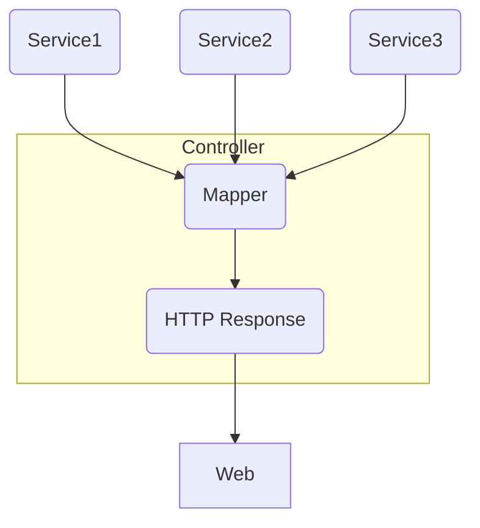

# 从交付 API 到交付 SDK

> 如何在全栈协作中进一步提高效率？分享下最近的实践。

## 背景

传统 Web 前后端协作模式中，HTTP API 是前后端的分界点，服务端交付 API，Web 端根据 API 构建应用。

这里，HTTP API 同时有两个作用：

1. 契约：约定数据交换格式；
2. 解耦：前后端分离，基于契约并行开发；

解耦，换句话说，就是隔离共享。解耦带来共享的困难，所以解耦通常应用在，共享较少的地方。
在传统的 Web 开发中：Web 使用 JS 构建，服务端使用 Python 等其他语言。语言不同，基本不存在代码的共享。

在全栈模式下，服务端同样使用 JS/TS，依然选择 HTTP API 作为分隔点是否合适呢？

评价的标准依然是：以 HTTP API 为解耦点，是否阻碍了可能的代码共享。

## 问题分析

问题的核心：HTTP API 前后是否有共享代码的需求？

1. 服务端的类型定义，比如 HTTP 请求和返回的类型定义，前端可以复用；
2. 前端请求函数，后端可以复用，作为 e2e 测试代码；

发现至少两个地方的代码是有共享需求的。

## 实践

### 项目简介

前端H5和小程序，服务端 NodeJS，分别在三个 Git 仓库，语言都是 TS。

### 代码共享机制

使用 git submodule 进行代码共享。

### 过程

起初，只是在服务端建立一个共享文件夹，里面两个子文件夹，type、fetch，用于放置可同时被H5和小程序使用的类型定义，以及自测用例中封装的请求函数。

慢慢发现，可被跨端复用的代码远比一开始预想的多，比如，数据转换逻辑。

数据转换逻辑是指：一个 HTTP 接口背后往往聚合多个 service，把多个 service 的数据聚合到一块后，一般不是直接给到前端消费，而要过一次数据转换，来适应 UI 展示的需要。



不难发现，数据转换 Mapper，放在服务端响应前做，还是放在前端接收到响应后做，其实是等效的。
而且 Mapper 从逻辑上更贴近 UI，Web 端更希望能控制 Mapper 的逻辑，随着 UI 的调整而变化。

所以，这里把服务端的数据转换提出来，共享出去，让 Web 端可根据需要修改。

最后整个共享文件夹形成下面的结构：

```bash
├── const ## 常量 
│   └── router.ts ## HTTP path 等路由相关的常量
├── fetch ## HTTP 请求函数
│   ├── activity ## 活动相关的 HTTP 请求函数
│   │   └── index.ts 
│   ├── user ## 用户相关的 HTTP 请求函数
│   |   └── index.ts
│   ├── README.md 
├── logic ## 可被跨端复用的逻辑
│   ├── mapper ## 数据转换逻辑
│   │   ├── activity.ts
│   │   └── user.ts
│   │── utils ## 工具函数
│   │   └── time.ts
│   ├── README.md
├── README.md
├── types ## 可被跨端复用的类型定义：interface/enum 
│   ├── mock ## 接口返回的示例数据，两个用途：前端 mock & 推导类型
│   │   ├── activity.ts
│   │   └── user.ts
│   ├── activity.ts
│   ├── global.ts
│   ├── user.ts
│   └── README.md
```

## 总结

在这样的模式中，Node 开发除了常规的 server 开发外，要编写 e2e 用例，并且把用例的请求函数，以 sdk 的方式，把代码共享出去，让前端获取数据时，只需要调用函数，不用关心 HTTP 请求的所有细节，并且函数具有类型签名。

优势：

1. 因为前后端语言的一致，JS/TS 代码可作为沟通语言，自然语言的接口文档也不在必要。
2. 跨端消除信息重复，使得一个功能，对应的代码，在前后端范围内，只有一份。

这也是，前后端分离背景下，Node 相对其他语言的不可替代性。

## 感想

直接交付 SDK，其实在 RPC 调用中很常见。
因为 RPC 接口通常有结构化的协议文件，比如 protobuf，可以借助自动化工具，生成各种语言的调用 SDK（即桩代码 Stub）。
HTTP 没有主流的结构化接口描述语言，而且接口风格灵活，很难通过自动化工具直接输出 SDK。

前后端分离、分工的细化，带来了效率的提升。
然而分离，也推高了“沟通”成本，抵消了一部分分工带来的效率提升。
Node 的出现，全栈的推广，其实带来了转机 —— 前后端语言统一。
代码的复用，终于可以又一次跨越端的边界，让效率的提升再上一个台阶。
包括最近流行的一些概念，比如前后端一体化，背后思路都是为了让代码跨端复用，从应用整体减少重复。
