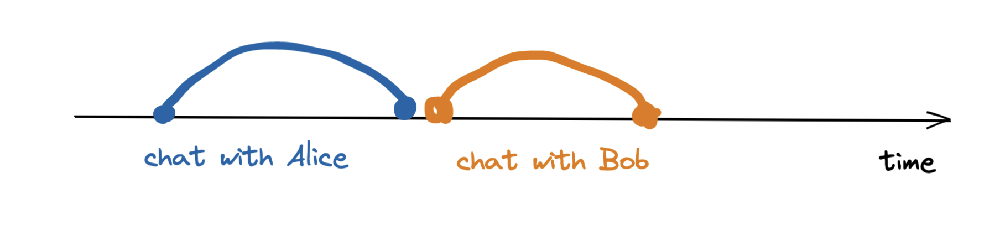
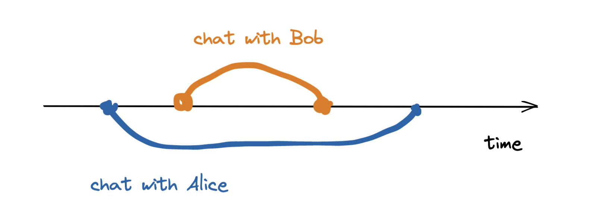
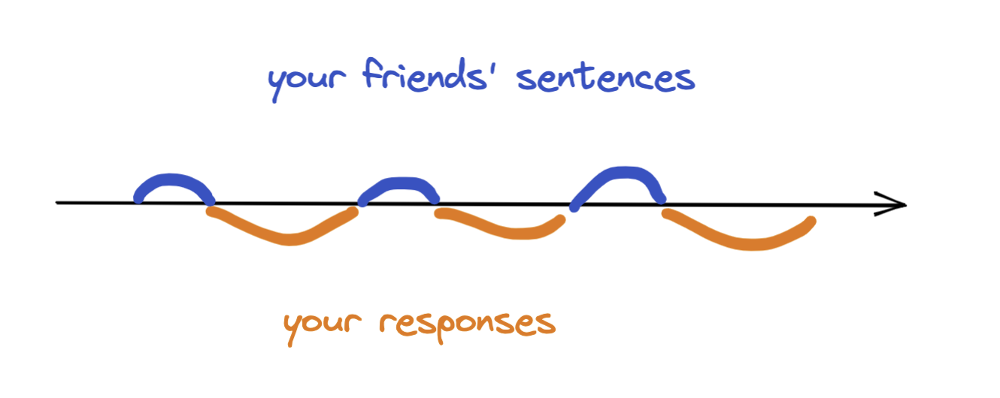
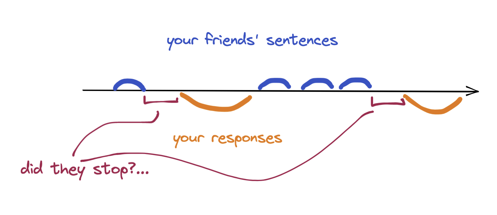
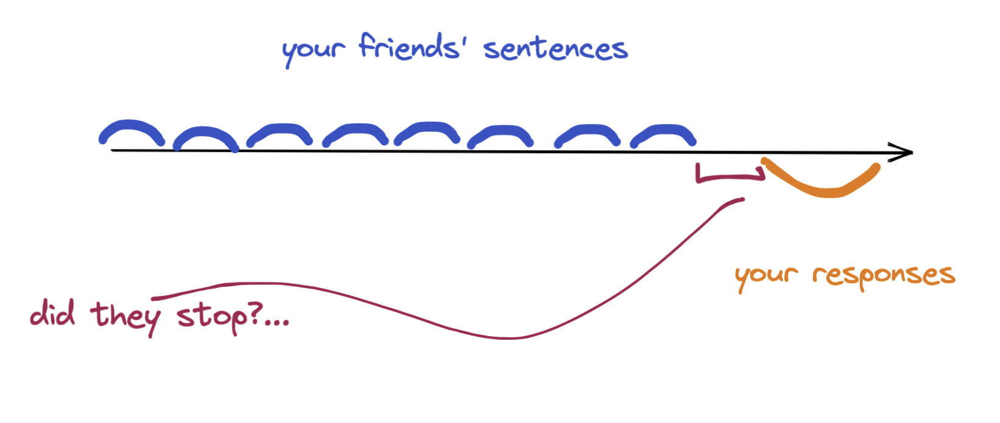
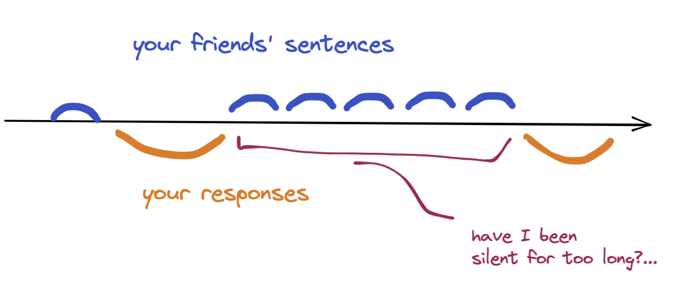
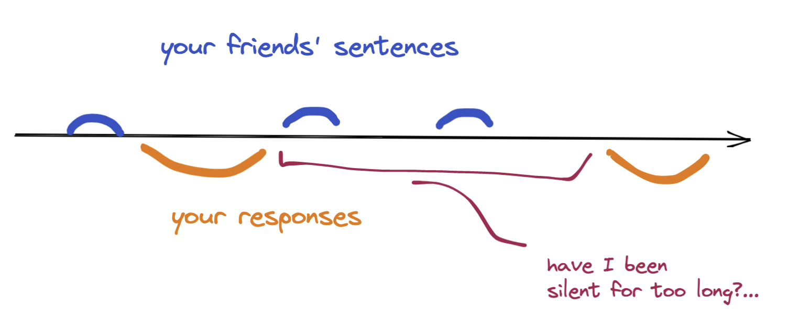
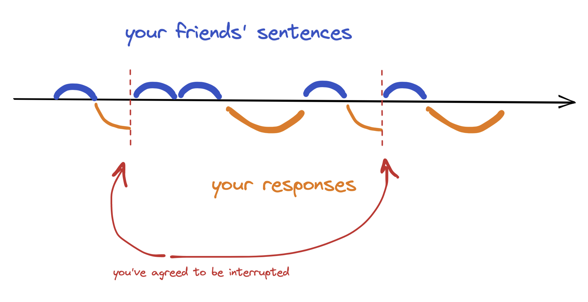
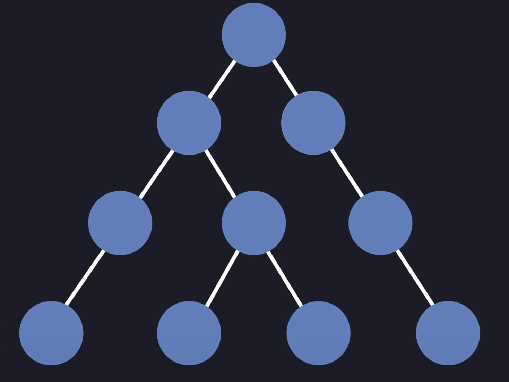
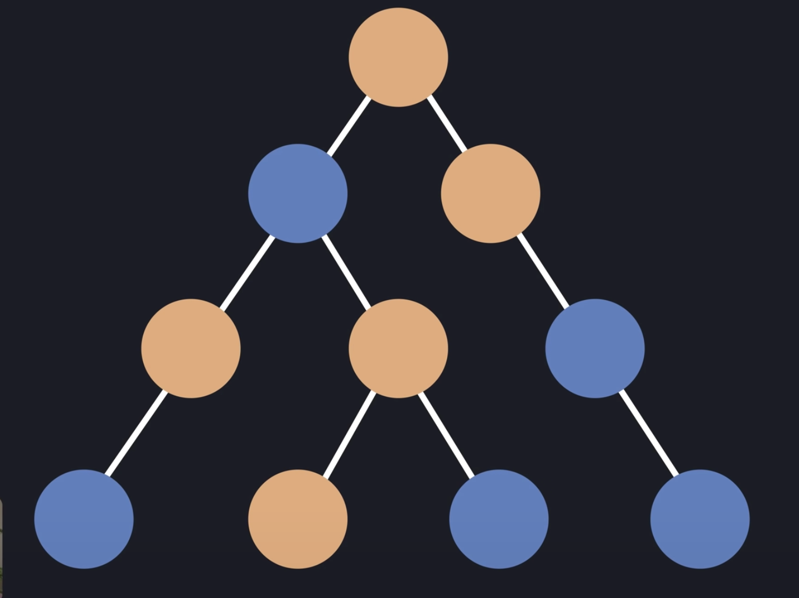

# 怎样向 5 岁小孩讲 React

> Making links is the key to lasting knowledge.

## 前言

通过建立联系（新的知识和已有认识），可以让学习的过程更加轻松和高效。

但每个人的知识背景不同，建立联系的方式也不同。掌握前置知识越多，联系的建立就能越多越容易，这也是[之前文章](https://zhuanlan.zhihu.com/p/466213908)强调基础重要性的原因：基础就像这些链接的中心。

5 岁小孩认识十分有限，一个概念，如果解释到他们都能听到，实属不易 —— 需要对概念特性有深刻把握，以至于外延到 5 岁小孩的认知范围。

就在前几周，试图给我家娃（也快 5 岁了）讲「惯性」：
大山很难推动，海浪很难停下，不动的东西很难动，动的东西很难停下，这就是惯性。看着充满迷惑的小脸，赶紧补充到，就像你在外面玩，一直玩不愿意回来，在家看电视又一直不愿意出去一样。

有没有可能把 React 中的概念讲到 5 岁小孩都能听懂？

let's try!

## React 中的术语

以下内容基本意译自 [Glossary + Explain Like I'm Five](https://github.com/reactwg/react-18/discussions/46)，强烈推荐跳到原文也看看。

### 并发（CONCURRENCY）

想象你给两个好盆友（Alice & Bob）视频，如果只有一个手机，你只能一个一个来：



如果现在爸爸妈妈的手机都给你了，两部手机，你就可以一个手机拨给 Alice，一个拨给 Bob：



两部手机的视频方式，叫并行。

虽然只有一个嘴巴，但是可以一会和 Alice 说，一会和 Bob 说，这看似和只有一个手机没区别，但如果遇到了这样的情况：

你特别想和 Alice 一块玩泥巴，电话约时间，但是 Alice 说要和妈妈商量下，让你不要挂电话。
等 Alice 回来的时间很无聊，这时如果有另一部手机，猜猜你可以做什么：

电话的好朋友 Bob，随便聊会打发时间。

这样当 Alice 回来后能立即接上，又不会因为等待无所事事。

和 Alice 打电话比较重要，类似重要的事情，在 React 中用 setState；和 Bob 闲聊不重要，类似用 startTransition，表示当有重要的事时，可以随时打断。

### SUSPENSE

记得上次拉勾吗，妈妈说，可以看电视，但要等到你把饭吃完。看电视这件事就被 suspense 了，除非把饭吃完。

同样在 React 中，如果有东西（组件）要等干完一件事才能干另一件事（rendering），可以用 SUSPENSE 标记下，这样事事就能和我们拉勾时约定的顺序一致了。

（对于前端背景，其实有一个更好的类比：Promise。）

### Batching

想象你要准备做早餐：

这时候发现没有牛奶了，然后跑到旁边超市买了一瓶回来。
过了一会又发现没有面包，又跑超市买了面包跑回来。
接着发现没饼干了，又跑一趟...

最终，做好了早餐，可以开始吃了。

但是，有没有发现你可以更短的时间做好早餐，而且不用跑那么多路？

把所有要买的东西提前想好，然后跑到超市一块买回来，就可以立即做早餐了。就像妈妈一直给你说的，凡事要有规划，永远不要让重要的事是第一次。

提前想好，然后一块做，这就是 Batching。

在 React 中，每一个要买的东西，就是一个 setState：

```js
setIsFetching(false);
setError(null);
setFormStatus('success')
```

显然每次 setState 就 render 十分低效，提效的办法和做早餐一样：先记录下变动，最后一块更新。

但是计划总有疏漏，就像上学的半路发现忘带画笔一样，你如何确定自己已经想好了做早餐需要的所有东西？

其实你不能，除非妈妈给了你一个菜谱，上面画上了每个需要的东西。

在 React 中也一样，怎么知道 setState 结束了，可以 render 了呢？

同样也不能，除非 setState 写在 event handlers（超纲...）中，如此 React 就知道啥时候更新了：

```js
function handleClick() {
  setIsFetching(false);
  setError(null);
  setFormStatus('success')
}
```

React 负责调用 handleClick，所以它知道啥时候结束：

```js
// Inside React
handleClick()
updateScreen();
```

### Automatic batching

回到刚刚做早餐的例子，妈妈没给你菜谱，要你自己想怎么办？

如果总是担心遗漏什么，一直在想，可能到了中午都没出门买东西，如何能做好早餐呢？

如果不假思索，刚想一会就跑出去了，遗漏了，岂不要再跑一趟？

所以，你只能给自己一个时间点，比如 8 点要做好饭，那么无论如何要 7 点前出去买东西。

同样的，如果 setState 没在 event handlers 里，其实 React 也不知到时候结束，它只能选一个时间点，既不能立即（每次 setState 就 render），也不能太晚：React 选择 microtask 结束后。

随着你做早餐的次数变多，越不容易遗漏，预估的时间点也越准。React 在这方便就不如你了，它并不会因为 render 了很多次，而变聪明。

### HYDRATION

还记得刚刚爸爸给你的电动小汽车充电吗？

只有充上电，你才能开着它到处跑，在充电之前，虽然还是这个小汽车，但只能呆在原地，一动也动不了。

给小汽车充电就是 HYDRATION。

HYDRATION 往往出现在 SSR（我们马上讲到），一旦使用了 SSR，render 一个组件就分为两步：

1. 先给浏览器发送一个没有任何交互的 HTML、CSS，用户能立即看到长什么样子，却不能点击里面的按钮。
2. 这时开始「加电」（HYDRATION），加载 JS 给 HTML 添加交互，按钮点击，下拉等。

### SSR

就像我们在家吃饭还是到外面吃一样：

在家吃饭，妈妈要准备菜、葱姜蒜，做好了然后才能开吃。客户端渲染也是这样，准备好渲染页面需要的材料 —— html/css/js，浏览器一顿烹饪，好看的页面就出来了。

在外面吃饭，就省事多了，等者把饭端上就可以开吃了。服务端渲染也是这样，浏览器不用费劲烹饪，需要做的只是开吃 —— 给页面绑定用于交互的事件。

### PROMISE TICK

上次去买奶茶，服务员是不是给了一个小圆盘，当我们的奶茶做好后，这个小圆盘就会响，这时候就可以到柜台取回来喝了。
类似的，PROMISE TICK 就是这个小圆盘，告诉我们「奶茶」做好了。
如果仔细观察，会发现，服务员并不是在奶茶做好后，小圆盘立即就响了，而是等服务员结束了手头正在忙的东西后（比如新顾客的买单），才按响了小圆盘。
类似的，PROMISE TICK 也是等到所有同步任务执行完。

### FLUSH SYNC

你会慢慢攒零花钱买玩具，FLUSH SYNC 就是立即把这些零花钱换成玩具。

在 React 里，flush synchronously，等价于，立即更新屏幕。

```js
flushSync(() => {
  setState(something);
});
// By this line, the screen has been updated
```

### DEBOUNCING AND THROTTLING

DEBOUNCING 和 THROTTLING 都是插话办法。

想象妈妈给你讲故事，但是妈妈希望在讲的时候能一块互动，但是你选择什么时候和妈妈互动呢？

#### Synchronous

可以等妈妈说完一句话就马上插话：


（图中 your friend => your mom，下同）

如果你只是插一句很短的话，比如 太棒了，没什么问题，但是如果你插了很长的话，会十分影响妈妈把故事讲完。

这个插话的办法叫 Synchronous，并不好。

#### Debounced

你可以等妈妈停一会，可能是暗示你接话的时候再说：



这个插话的办法（叫 Debounced）很好，但是有个前提，妈妈会故意停顿，暗示你接话。如果妈妈不停顿呢？



岂不你永远接不上话？

#### Throttled

为了避免永远也接不上话，你可以这样，拿一个小闹钟，一看到妈妈讲了一分钟，立马打断妈妈：



这个插话的办法叫 Throttled，在妈妈滔滔不绝的时候十分有用。但是如果妈妈已经停下了，暗示你说话，你却还在掐着小闹钟计时，岂不很尴尬：


#### 在 React 中

我们发现，上面三种插话的办法都不完美。React 中也面临类似的插话问题：

用户不断在敲键盘输入字母，React 要想，啥时候我可以打断输入，更新页面呢？

React 18 引入了一个绝佳插话策略：充分利用了 Debounced 和Throttled 的优势。



一旦妈妈说完一句话，你立即插话，但是呢，你告诉妈妈：如果觉得时候不对，可以随时打断我。

在 React 里，用户敲打一次键盘，React 都立即更新页面，但是后续的键盘点击可以终止上次的页面更新。

这样，既可以尽快更新页面，又不做徒劳的更新。

在 React 中，使用这个插话策略的 API 是：[startTransition](https://github.com/reactwg/react-18/discussions/41)。

### SERVER COMPONENTS（超纲）

我喜欢从 SSR 的角度理解 server component：
server component 带来了组件级别的 SSR，换句话说，SSR 是把最外层的 <APP> component 作为 server component。

dan 提出了一个视角来理解 server component：
想象我们的组件树，从一开始的只能在 client 运行，变成了，可以自由（当然也不是完全自由，能在服务端运行的组件有特殊要求）指定哪些运行在服务端，哪些继续运行在 client：



=> 



强烈推荐这个视频 [Introducing Zero-Bundle-Size React Server Components
](https://reactjs.org/blog/2020/12/21/data-fetching-with-react-server-components.html)，详细说明了 server component 的缘起和优势。

### FAST REFRESH（超纲）

基于热更新（hot reload）理解 fast refresh：fast refresh 是 hot reload 的升级，解决 hot reload 丢失应用状态的弊端。

### APP STATE, COMPONENT STATE, UI STATE（超纲）

首先，为什么要有 state：

可以那函数调用来类比：

在函数内声明的变量，会随着函数执行完而消失（除外闭包），下次调用又是新的。
如果不想这些变量保存了有用信息，不想随着函数消失怎么办？把变量提到函数外面。

提到函数外面的变量，就是 state，它们保持了组件内需要持久化的信息（下次渲染要使用）。

APP STATE, COMPONENT STATE, UI STATE 只是对不同作用域变量的称呼：APP 作用域、组件作用域、UI 也可以理解为 APP 作用域。

### RENDERS: RENDERS, RE-RENDERS, WASTEFUL RENDERS（超纲）

首先，什么是 render：

当你调用 setState 后，React 给以 「render」为回应。

在 render 过程中，React 会从你 setState 的 component 开始，询问 component 在新的 state 下，如何展示。如果 component 有自己的 component，这个过程会递归下去。

re-render 就是把 render 在做一遍，既然是再做，当然有很多优化空间来偷懒。

wasteful renders 就是 render 中需要优化掉的工作：即使状态改变，展示也不改变的 component，这些 component 没必要 render。

有一些办法可以告诉 React 避免 wasteful renders：

- 尽量下沉 state，减少影响的组件树；
- 用 memoized 告诉 React，这个组件是纯的 —— props 不变，展示不变。


