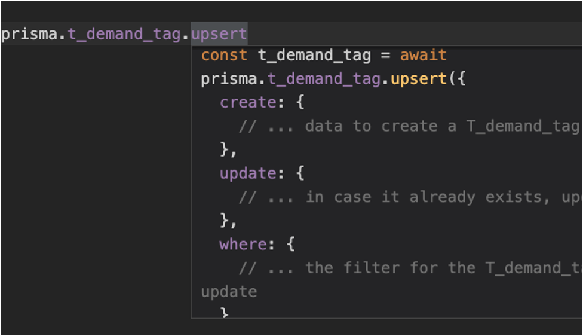

# 使用 prisma 操作数据库

> 一个几乎不需要看文档就能使用的 ORM —— prisma。

## 背景

ORM：Object-relational mapping，是把对象和关系型数据库建立映射的过程。
实际应用开发中，基本都会引入 ORM 来辅助操作数据库，通常被提及的好处，例如：

- 可移植性，方便切换数据库；
- 比直接写 SQL 效率高，方便多表联查等；
- 可维护性高，和业务代码语言一致
...

和所有的技术选型一样，没有一种尺寸，适合所有的情况，ORM 也是如此。

下面看看操作数据库有哪些途经，以及利弊。

## 操作数据库的途经

### High level: ORM

使用 ORM 的好处，前面已经提到。实际应用开发中，不是所有的好处都成立，比如可移植性，目前还没有中途换数据库的情况，换数据库基本表明前期的方案设计有致命缺陷。

而且，如果下面的原因，更应该慎重选择 ORM：

- 避免学习背后的 SQL

这无疑加大应用开发时的挫败感。每个报错，都会逼迫深入 SQL，甚至储存原理，而且你总会碰到报错。

此外，关于特定 ORM 的使用经验，很难跨语言迁移，甚至跨库迁移都不容易，想象下 sequlize 和 typeORM。

下次再想走捷径的时候，屏息一分钟，想象站在陡峭的高山下：
面前一个艰险的云梯，直上直下；一个盘山公路，平坦宽阔。选择走哪个？

**最难的路 —— 直上直下的云梯，才是路径最短的路。**

- 表达力有限

这个取决于具体使用的 ORM，比如 where 中存在子查询的场景，一般写法比较繁琐。

如果因为上面或其他原因，需要剥开 ORM 的抽象，继续下探，Query builder 是一个不错的过渡。

## Middle level: Query builder

比如 Node 中流行的 [Knex.js](https://knexjs.org/)。

激进派可能直接从 ORM 跳到了 raw sql，最后不过是又积累了一遍自己的 query builder —— 重复造轮子。

日常应用开发中，高频场景模式固定，存在大量 sql 片段在不同查询中重复。query builder 就是消除这种重复的辅助函数。

## Low level: Database driver

这一层，也称为 raw sql。
不管是因为 ORM 表现力不够，还是需要某种更底层的特性（直接控制connection pool?)，这时，[node-mysql2](https://github.com/sidorares/node-mysql2/tree/master/documentation) 是个不错的选择。

不过天平的另一端：缓存、防注入、执行效率、唯一索引校验等都需要自己额外关注。

另外经常 explain sql，既然都到这一层了，自己写的 sql 执行效率还没 ORM 自动生成的高，就说不过去了。

## Node ORM prisma

在熟悉了 MYSQL 工作原理、SQL 语法后，日常应用开发中强烈推荐 [prisma](https://www.prisma.io/)，能极大消除重复。

### 基本用法

假设链接到一个已有的数据库。

1. 安装，并初始化

```bash
npm install prisma -S

// 生成 schema.prisma 和 .env
npx prisma init 

// 根据 .env 配置的数据库 URI，链接数据库、更新 schema
npx prisma db pull
// 通过 schema 生成桩代码和类型
npx prisma generate
```

2. 应用中实例化一个 client

```js
import { PrismaClient } from '@prisma/client';
export const prisma = new PrismaClient({
  // 可以根据需要开启不同等级的 log
  // log: ['query', 'info', 'warn', 'error'],
});
```

3. service 中使用

在输入 prisma 对象后，立即提示所有可选的表名，不要惊讶，当继续输入任何一个方法后，比如 upsert，会看到下面的用法提示：

直接弹出了示例，甚至注释都是专属！

这就是使用**代码生成方案**的 prisma 相较于 sequelize 等的优势之处。

更重要的，获得这一切好处的成本几乎为 0 —— 数据库是唯一的数据源，自动化的流向了代码，什么也不需要做。

## 总结

正如在[根本提效途径](https://zhuanlan.zhihu.com/p/459375469)中提到，工具的价值之一：**自动化已有信息的传递**。

prisma 通过生成查询桩代码/类型，自动化了数据库表信息到应用的传递。
而其他 Node ORM 库，普遍只做到了为 SQL 查询换一个写法：拿应用的语言来写。

### 技术要点

- 不能把任何 ORM 作为逃避学习 SQL 的手段；
- 代码生成的路线，在 ORM 中效果显著；
- prisma 尤其适用多个微服务数据库共享场景（想想每个服务定义一遍 model 是不是要疯掉！）；
- 唯一数据源的价值 —— prisma 中数据库是唯一数据源。

