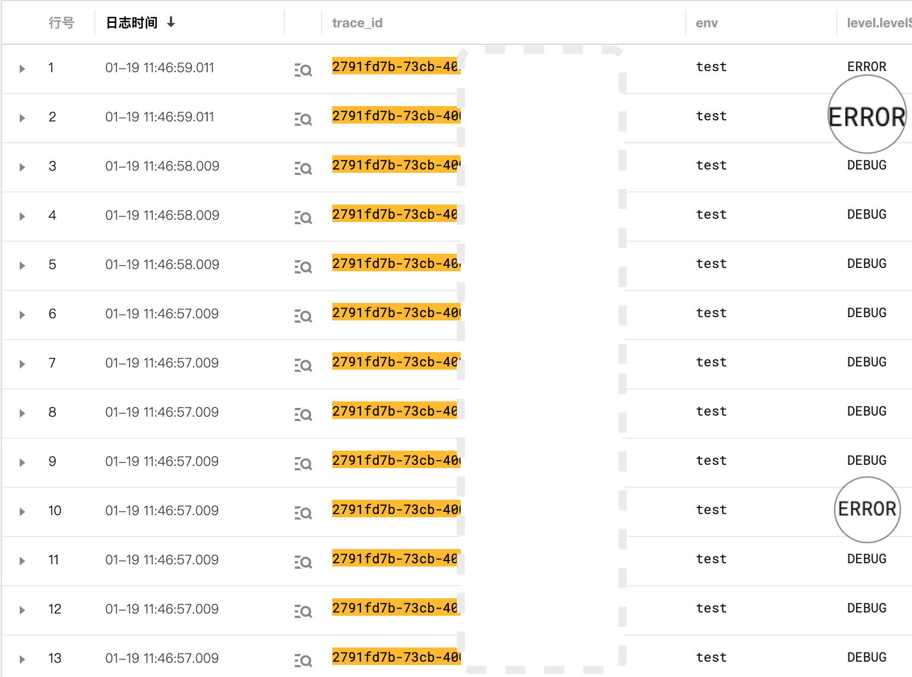
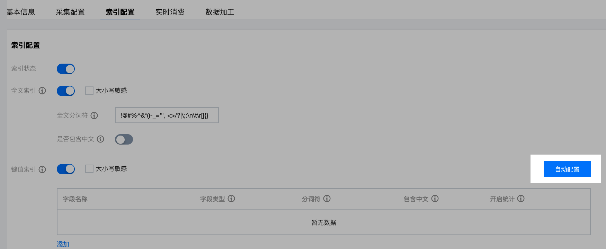

# 基于 log4js 做全链路日志

## 背景

提到监控或应用观测，经常出现三个词：「链路(Tracing)」、「指标(Metric)」和「日志(Logging)」。

所以什么是全链路日志呢？简单说，就是每条日志包含链路 ID（trace id）,比如：

```json
{
   "projectName":"some_project",
   "env":"test",
   "uid":"xxxxx",
   "trace_id":"03babddsdscf5-d3f-8eea-26e56459b2",
   "path":"/api/test",
   "cost":"300",
   "startTime":"2022-01-18T15:59:59.048Z",
   "categoryName":"default",
   "data":[
      "响应请求：xxx",
   ],
   "level":{
      "level":10000,
      "levelStr":"DEBUG",
      "colour":"cyan"
   },
   "context":{
      "user_name":"fjywan",
   },
   "pid":1839
}
```

这条结构化日志中包含一个重要字段：trace_id。
根据 trace id 能串起一个请求，从「发起」到「响应」的全部日志：

就好像函数的调用栈，通过这组日志，能观察一个请求的完整情况，哪一步出现了 error，帮助快速定位出现问题的节点。

既然全链路日志对定位问题如此重要，如何在项目中使用呢？

## 方案设计

### trace id 的生成时机

既然记录一个完整请求，那么 trace id 就应该在请求发生的那一刻生成。

请求一般起始于端上，比如初始化页面拉数据、用户行为触发等，所以，端上负责生成 trace id，然后附加到请求上。

### 通过 HTTP 请求传递 trace id

trace id 属于请求的附加信息，一般放在 header 中。
约定 header 中 'X-Request-Id' 放置 trace id。

### 日志的结构

字符串日志不利于后续分析，所以，输出的日志一定要是结构化的，比如 json。
日志中需要记录的必要信息：

- trace id：不多说了；
- project name：项目或者服务名，尤其微服务架构，很关键，表明哪个服务输出的这条日志；
- env：环境，如果日志根据环境存储在不同位置，这个字段就不必要；
- uid：用户标识，比如系统的用户 id、用户名等，可以通过 uid 串起一个用户的完整活动日志，就像 trace id 一样；
- path：HTTP 请求的路径；
- cost：耗时数据；
- start time：开始打日志的时间；
- level：日志等级，很关键，日志分级是告警的基础，也方便快速定位问题节点。

### 日志的储存和检索

把日志直接文件储存最简单，但是不利于后续合并检索和分析。
这里我们可以借助开源工具，比如经典的 [ELK](https://www.elastic.co/what-is/elk-stack)，包含日志搜集、储存和可视化。
如果腾讯云，可以使用 LogListener 搜集日志，对接 cls 日志服务，一站式完成容器日志搜集、储存、可视化。

不管哪种日志搜集工具，一般都支持两种来源：file 和 http。


端上采用 http 的方式搜集日志，容器内使用 file 搜集日志。

## 实现

以 koa HTTP Server 为例，基于 log4js 实现服务端全链路日志搜集。log4js 的详细 API 可以参考：<https://log4js-node.github.io/log4js-node/>

1. 配置 log4js 输出 json 日志到文件

```js
import log4js from 'log4js';
log4js.addLayout('json', config => function (logEvent) {
  return JSON.stringify({
    projectName,
    env: process.env.NODE_ENV || '',
    uid: logEvent.context.uid || '', // uid
    trace_id: logEvent.context.trace || '', // trace_id
    path: logEvent.context.path || '', // request path
    cost: logEvent.context.cost || '', // costtime
    // 里面有 startTime 等标识日志时间的字段
    ...logEvent,
  }, 0) + config.separator;
});
log4js.configure({
  appenders: {
    global: {
      type: 'dateFile',
      filename: 'logs/global',
      pattern: '.yyyy-MM-dd.log',
      alwaysIncludePattern: true,
      layout: { 
        type: 'json', 
        separator: '' 
      },
    },
  },
  categories: {
    default: { 
      appenders: ['global'], 
      level: 'debug' 
    },
  },
});
```

这里可同时配置多个 appender，比如输出到机器人告警，感兴趣可以参考之前的一篇文章 [解决告警轰炸的一种实现](https://zhuanlan.zhihu.com/p/459166200)。

2. 每个请求获取一个新的 logger 实例，并附加 trace id

```js
import { v4 as uuidv4 } from 'uuid';
import Koa from 'koa';
import { getLogger } from 'log4js';

const app = new Koa();
app.use(async (ctx, next) => {
  // 每个请求都要一个新的 logger 实例，以便有一个全新的 log context；
  // logger 实例同时挂载 ctx 上，方便取用
  if (!ctx.logger) ctx.logger = getLogger();
  // 添加 trace id
  const traceId = ctx.get('X-Request-Id') || uuidv4();
  // 附加 trace id 到 logger 的 context 上，这样后续每个 log 都会携带 trace id
  ctx.logger.addContext('trace', traceId);
  // 同时附加请求的 path 
  ctx.logger.addContext('path', ctx.request.path);
  await next();
});
```

3. 每个需要打日志的地方，透传这次请求生成的 logger 实例。

比如 controller 中：

```js
import Router from 'koa-router';
export const router = new Router();;
router.get('/api/test', async (ctx) => {
  ctx.logger.debug('hello')
  // 透传 logger 到调用的 service
  const data = someService(ctx.logger)
  ctx.body = {
    retcode: 0,
    message: 'ok',
  };
});
```

`ctx.logger.debug('hello')` 的调用不单单是向日志文件输入 hello 的字符串，因为前面定义的 json layout，输出时会附加 logger 的 context，最终类似开头的 json 字符串。

稍微麻烦的地方：任何打日志的函数，都要透传 logger 实例。优化办法可以参考之前的一篇文章 [如何用domain减少logger的传递](https://zhuanlan.zhihu.com/p/457472209)

4. 打日志的时机

日志打多了，虽然可能干扰关注点，但无大碍。
日志打少了，却可能丢失关键线索，导致无法定位问题。

经验上，有这样几个时机必须要打日志：

- HTTP 请求到达时，log 请求体（query、body 甚至包括 cookie）；
- HTTP 返回/异常时，log 结果；
- RPC 调用前后，同 HTTP 请求，要加 log；

可以统一为：任何网络通信前后，必须 log。

MYSQL 或其他储存依赖，根据实际场景打 log。
这些储存库不像 RPC 调用，一般无执行 BUG，只能是入参有问题，入参的问题根据异常就可以定位了。

5. 配置 logListener 搜集指定文件的日志

如果没有，创建一个日志主题，一般按应用建主题即可：


配置日志文件采集路径：


这里详细的步骤参考：[LogListener 采集 > 采集文本日志 > JSON 格式](https://cloud.tencent.com/document/product/614/17419)

6. 日志索引配置

配置日志索引，可以类比为设计 MYSQL 表结构。

因为日志是 json 结构，可以直接根据日志数据推到 schema，自动配置日志索引：


7. 检索日志

配置完索引，就储存了结构化日志，可以根据字段愉快检索了。


查询支持类 SQL 语法，十分方便。

## 总结

全链路日志是问题定位的利器，不仅如此，结构化的日志还能聚合有价值的指标，比如成功率、耗时分布、甚至 DAU、区域分布（根据 ip）等。

借助 log4js 记录全链路日志，业务代码侵入小，并且保持了熟悉的打 log 方式。

### 技术要点

1. trace id 的透传一定要贯穿每个服务，尤其微服务场景，是不小的挑战；
2. 记录日志的时机：每个网络请求（HTTP/RPC）的开始、返回、异常；
3. 结构化的日志是关键；

## 拓展

全链路日志就像调用栈：一个用户的 HTTP 请求，可能唤起另一个 RPC 调用、接着另一个...，如此形成一条「网络调用链」，就像函数的调用栈一样。

并且现在已有开源工具，可以把全链路日志可视化为调用栈，比如[Jaeger](https://www.jaegertracing.io/docs/1.30/)：


