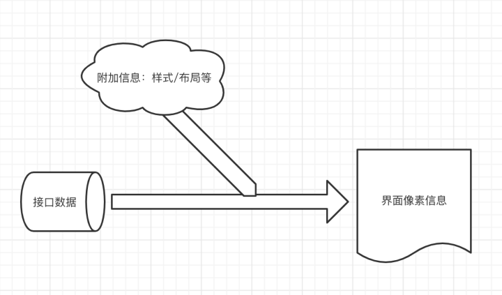

# 前言篇

> 从思考变量命名、如何封装函数、如何表达执行逻辑更清晰、如何选择事件和回调、如何减少函数的入参、什么时候引入 context、如何快速定位 BUG，到如何写一个容易复用的函数、如何在灵活和易用间权衡、为什么抽象概念、如何建模...

几年间，一直处于「发现问题、解决、遇到更多、解决」的循序中。
但我始终相信：

1. **只要有一个追求本质、不拘于现状的心态，这些问题都会碰到，只是时间的问题。**
2. **如果一个方法对解决一个问题是有效的，那么大家最终都会到那，也只是时间问题。**

即便当前的理解仅是一个「快照」(很可能在遇到下一问题后，就会发生变化），
也能为 「群体演化到最佳方案」提供助力。

## 综述

前端主要关注这一段：从接口数据到界面展示。

如果从最高抽象来看：
**接口数据信息，通过附加交互（js）及布局样式（html/css）信息, 最终流向屏幕的像素信息。**

（前端工程抽象）

所以，前端所有的工程手段，只有两个目的：

- 自动化
  - 对象：已有信息。
  - 解释：自动化已有信息的传递，比如接口协议信息到代码，接口数据到页面状态。把手动的代码翻译，调整为自动转换。
- 共享
  - 对象：附加信息。
  - 解释：接口数据信息，到屏幕上的像素信息，还有很大的『信息 gap』，比如，如何搜集接口的入参，如何展示接口返回的数据。对附加信息，手动编码是必须的，但只希望同样的信息，手动编码一次，而不是用一次，编码一次。所以，对附加信息来说，共享是关键。

**当我们考察一个具体的工具、办法时，就是评估这个工具/办法，对信息的自动化和共享分别做了什么贡献。**

比如，常说的低代码、无代码、数据驱动 UI 生成、接口编排等，每个团队发展到一定阶段，都会因为效率瓶颈，涉猎和研究这些工具。而这些工具的有效性也分别体现在如何自动化了工作流和如何促进了代码、组件、功能、服务的共享。

但是，有一点，我称为 「劳动力转移」，它指的是：把工作量从一种角色转移到另一个角色，比如，把界面的开发转移给设计和产品；把测试的工作转移给开发。因为从整个功能开发流看，相当于把下一个环节的工作移到了上一个环节，所以，也形象的称为「左移」。

**「劳动力转移」或「左移」的价值并不在自动化和共享（消除了工作量），而在敏捷。通过缩短信息流转路径和某种意义上的工作量再分配，加快产品功能交付。**

比如，管理端低代码，通常包含数据生成页面（自动化接口信息到页面）、组件共享机制，同时以可视化的操作方式，朝着开发左移的方向发展（有朝一日，运营或产品也能 cover 开发才能做的事）。

**这其实就是本质，让我们在思考如何提效时，可以透过纷繁复杂的框架、工具，看到背后真正起作用的是什么，而不被「变换的表现」妨碍了判断。**

同样还是上面的管理端低代码，我们说，目前可视化低代码方案，其实同时在三个方面贡献了价值：

1. 自动化
2. 共享
3. 劳动力转移

但是，前两方面，自动化和共享，通过代码化的方法（比如合适的 cli/分类/interface 约定等）也完全可以实现同样的自动化和共享，就现阶段来说，可能比可视化做的更好。
但**可视化唯一不可替代的价值，其实在，劳动力转移**。

## 大纲

通过综述部分的铺垫，我们明了了前端（或者更广义的界面开发）的本质，建立分析框架。

基于这个框架，涵盖以下主题：

● 前端组件共享、自动化生成、开发左移（赋予需求方完成 demo 的能力）。
● 接口数据聚合、服务调用自动化、操作串联、功能增强。
● 前后端一体化，模型抽象。
