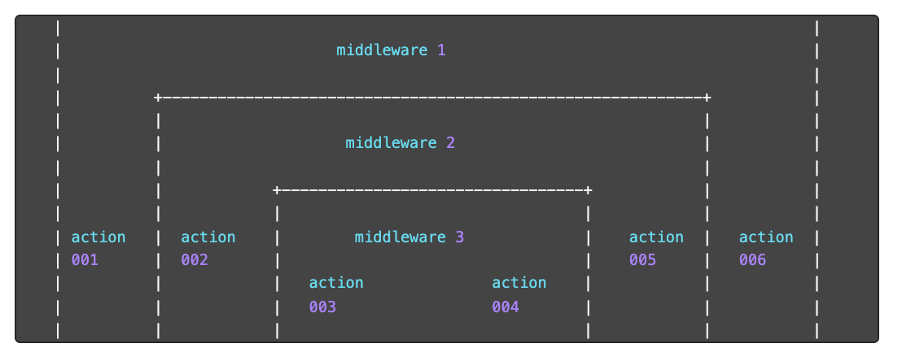

# 如何用domain减少logger的传递

> JS 用 event-loop 帮我们做线程调度，得到了便利，也失去了灵活。

## 背景

服务端开发中，全链路日志是硬需。
全链路日志的核心是 traceid，在接收请求的那一刻生成（或者从请求头获取），在请求处理中一直透传，用于附加在每个 log 输出。这样，就能通过 traceid 在日志中观测一个请求的完整过程。


(图片引用自：https://developpaper.com/understanding-koa-onion-model/)

traceid 透传在各个 action 中。

## 问题引入

正是为了 traceid 的逐级透传，我们经常在service里看到这样的代码：

```js
// 一个根据 id 查用户详情的 service
async function getUserInfo(idNumber: string, logger: Logger) {
  // 透传 logger
  const token = await getToken(idNumber, logger);
  // 透传 logger
  const resData = await getUserInfoByToken(token, logger);
  // 透传 logger
  const honorData = await getHonorByToken(token, logger);
  return {
    ...resData,
    honor: honorData,
  };
}
```

每个请求会实例化一个 logger 实例，实例中携带了 traceid：
为了让之后每个函数调用的日志都打印 traceid，我们要透传这个 logger
=>
封装的任何一个函数，最少都需要一个入参：logger。

有办法剔除 logger 参数吗？

## 问题分析

之所以需要透传，是因为不能简单的把这个 logger 作为一个 global 变量。

为什么不能把每个请求的生成的 logger 实例作为全局变量呢？

因为 JS 的执行方式：一个线程上，会在不同的请求间跳来跳去执行。以一个 fetch 为例，一旦我们发起了一个网络 IO，当前线程并不会干等着 Response，可能反手去处理另一个用户请求了。

```js
async function netIO () {
 await fetch('https://www.qq.com')
 // 这个执行前，可能插入了其他用户请求的处理
 console.log('fetch done')
}
```

如果 logger 实例在全局，会串在不同请求中。

这个单线程自动任务调度，就是 JS 以高效著称的 event-loop —— 无法干预。

## 解决方案

如果每个请求用一个单独的线程处理，就天然不会存在这个问题。
那么JS 中有没有办法为每个请求创建一个虚拟的执行环境呢。

受 [TSW](https://github.com/Tencent/TSW) 的启发，发现 JS 中的虚拟线程（执行环境）就是 domain。

文档中这样描述 domain：

> Domains provide a way to handle multiple different IO operations as a single group.  

Ref: https://nodejs.org/api/domain.html

按照这个思路，把一次请求从 request 到 response 的所有处理过程打包到一个 domain 内。

```js
// 以 koa 为例
const app = new Koa();
app.use(async (ctx, next) => {
  // 直接把 koa ctx 挂载到 domain 上，这样不仅 ctx 上的 logger 可以取到，request 也能取到
  process.domain.add(ctx as any);
  process.domain.ctx = ctx;
  await next();
});

const listener = app.callback();
http.createServer((req, res) => {
  // Creating a domain and wrapping the execution.
  const d = domain.create();
  res.once('error', () => {
    process.domain.exit();
  });
  res.once('close', () => {
    process.domain.exit();
  });
  d.run(async () => {
    listener(req, res);
  });
}).listen(port);
```

### 方案利弊

### pros

减少了函数入参。
可以类比成组件 props 的层层传递，通过引入 context，让组件更容易被使用。

而且，在一些场景，domain 是不可替代方案，比如 TSW，通过覆写 http request 来拦截流量，同时又想保留全链路日志，这里显然无法再传递logger，只能通过类似 domain 的 context 机制。

### cons

同样，因为引入了 context，组件不再是纯函数组件，测试变的困难。
具体到 domain，还会有性能问题。

引用自官方文档(Ref: [Domain Module Postmortem](https://nodejs.org/en/docs/guides/domain-postmortem/#performance-issues))：
> A significant deterrent from using domains is the overhead. Using node's built-in http benchmark, http_simple.js, without domains it can handle over 22,000 requests/second. Whereas if it's run with NODE_USE_DOMAINS=1 that number drops down to under 17,000 requests/second. In this case there is only a single global domain. If we edit the benchmark so the http request callback creates a new domain instance performance drops further to 15,000 requests/second.

## 总结

通常在两种场景才会考虑引入 domain：

1. 请求的处理存在大量异步调用（RPC、HTTP等），需要深层透传 ctx 中的数据。
2. 无法透传的场景，比如一些全局请求实例的 interceptor。

## 感想

JS 的执行，总让我联想到 CPU，程序被打断成一截一截的，每个 await、setTimeout、IO 操作，都会被插入其他代码执行。这个过程反直觉，相对于直接多线程编程，很难说 event-loop 是一个好的抽象，毕竟，一个好的抽象，是减少关注，也能用好功能。可是 event-loop，不了解这个抽象咋做的，压根用不好，很多出乎意料的表现，比如经典的 console.log 打印不出当前值，都在倒逼每个 JS 开发者拨开 event-loop，不然它也不会成为一个经典的面试题。

我的博客即将同步至腾讯云+社区，邀请大家一同入驻：https://cloud.tencent.com/developer/support-plan?invite_code=o70m2h8p2np3
