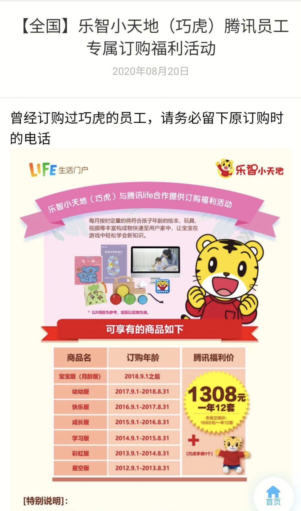

# 欲擒故纵：打击大客户和第二高价

> 采取看似与目标相反的行动，实际上却能更好地实现目标。

接下来分享三个反直觉做法及背后有效的原理，让我们日常决策也从此受益。

## 背景知识

你是否也有如下困惑：
- 为什么微信没有客服（开发者）?
- 为什么不能让工资成为自己唯一的收入来源？
- 为什么买房其实没有想象中那么好？

看完下面的内容，你就会豁然开朗。

不过在此之前，我们先来补充下前置知识：广告，下面三个策略经常被应用在广告领域。

**广告是一项三方参与的商业活动：媒体方、广告主、用户。**

媒体方关心的是：
如何在有限流量下获得最大收益。 这本质是一个有明确目标函数的最优化问题。

广告主关心的是：
投入产出比，即某次广告活动的总产出与总投入的比例（ROI）。

在这个活动中，用户往往是被动选择的。

在广告活动中，媒体方为了使自己的收益最大化，采取了下面三个策略。

## 打击大客户
咋一看，很反直觉，大客户可以创造可观的营收，为啥还要打击呢？
现在广告普遍采用竞价方式，有限的流量，所谓价高者得。
问题就转化为，怎样把竞拍价抬高，总体收益最大化呢？

用两个例子来深入这个问题。
1. 王健林拍得毕加索画后接受采访，记者问：「王总，3000万美金一幅画，你觉的贵吗？」
「太便宜了，我揣着 5000万支票来的」，据说拍卖员听到后要气晕，连别人的心理价位都没拍到。

很有意思，转头一想，也容易理解，势均力敌的竞拍者，才能把价格推向高位。当竞拍者的实力悬殊时，拍卖行无法获得最大收益。
可行的办法就是打击王健林，给在场的其他竞拍者每人发2000万美元代金券。

2. 有一家公司只服务一个大客户 —— 可口可乐，结果 08 年金融危机，可口可乐削减预算，这家公司直接倒闭了。

当50%以上的收入依赖大客户时，收入的波动就会越大，越不稳。
从长远来看，会带来一个更严重的问题：挤压小客户，进而形成恶性循环。

**当依赖的是大量小客户时，任何一个小客户的去留都不会造成收益波动，而且随着客户量增多，趋近于完全竞争，会抬高竞价。**

这样看来，打击大客户很容易理解了。

## 第二高价

如何定价 —— 拍卖中面临的一个重要问题。

我们设想这样一个场景：
一个广告位，如果 A 出价1元，B 出价2元，我们把广告位分配给 B，并且按 B 的出价 2元收费。你猜 B 接下来会怎么做？
试探出价的下界，不断调低出价，直到 1.1 元，再低就发现得不到广告位了。

如果 C 这时加入竞价，出了3元，也会重复 B 的操作，把价格逼近 1.2。

在广告这样的场景，参与者可以针对同一标的物不断调整出价，如何通过合适的定价策略，为市场创造更高的收益和更好的稳定性呢？

这个策略就是第二高价。

A，B 竞价时，B 得到了广告位，但收费时，按照 A 的出价 1元收。这时当 C 加入时，必须要高于 2元才能得到广告位，这样当 C 竞得广告位时，按照 B 的出价 2元收。

不难发现，在第二高价下，媒体向广告主收取的费用不会超过其报价。

### 换个角度看第二高价

经济学里有个很有用的概念：机会成本。它提醒我们，计算一个选择的成本时，要考虑做出这个选择时，我们失去了什么？

举个例子：
张三计划买房，把房价、税费、中介费等加起来 300 万。但买这个房子的成本仅是300万吗？

因为买房，张三没法用这300万买特斯拉股票，放弃了资产翻倍的机会，损失了 300万。如此，这个房子的成本应该被记作 600万。

机会成本给我们带来的启发是，**用某个选择带来的价值损害来计算成本**。

B 竞得广告位，对其他广告主带来多大的损害呢，把损害作为定价，恰恰就是第二高价。

## 减少服务

巧虎受到很多家长的欢迎，不用自己费心挑选玩具、绘本、图书，巧虎按月龄规划好了，每月邮寄，自己挑可能都没这么好。

服务越少越挣钱，对媒体方更是这样。所以谷歌的广告没客服，Facebook 的广告简单到放个素材上去就可以了。

如果仔细想想，**服务越多，意味着门槛越高，能充分使用这些服务的广告主获得优势，而他们往往是有财力的大客户**。

前面说到要打击大客户。所以减少服务，不然小客户没得玩了。
