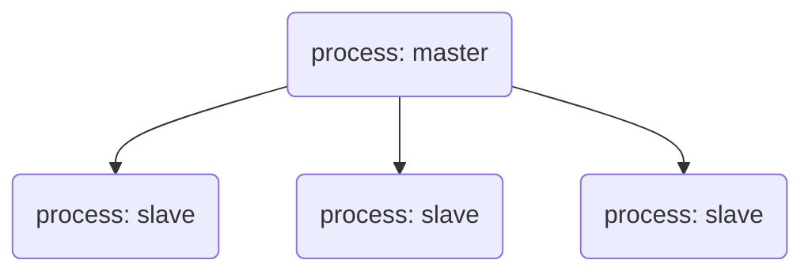

#! https://zhuanlan.zhihu.com/p/537959481
# http 和 https 能在同一端口提供服务吗？

想起个面试题：不同进程能监听同一 port 吗。

这是相同问题吗？

## 从端口说起

ip 标识了主机，port 标识了进程，数据到达主机后，依靠 port 分发到各进程。 —— 这是 port 引入的初衷，显然，此用途下，不同进程不能使用同一 port。

但是，随着互联网应用并发越来越高，port 的定位也在改变。



这是经典的主从架构，master process 只接受请求，然后分发给 slave process 处理。还是一个 process 监听一个 port，通过转移工作，提高了 master 的并发量。

当并发来到 4w 每秒，master process 也会遇到的瓶颈（在 Google 并非罕见：https://lwn.net/Articles/542629/）。

于是，Linux 3.9 之后支持 SO_REUSEPORT：把请求的负载均衡，从应用下沉到系统。至此，多个进程同时监听一个 port 成了可能。

题外话，node cluster 并非利用 SO_REUSEPORT，而是自己实现类似 master/slave 的负载均衡。

## 协议嗅探

所以，http 和 https 即便作为两个服务（process），也能够监听同一 port。

但这显然不够：请求不能随机分发，不同协议要转发不同 process。

另一个问题，根据不同协议，做不同处理，即：如何从 tcp 二进制包分辨协议类型？

设计 RPC 私有协议时，通常会有一个魔数（magic number）：每一帧特定位置写一个固定 number。它的作用就是协议识别，魔数给了识别的特征。

http 和 https 有类似的‘魔数’吗？

（纯幻想）long long time ago，某个大佬，怀着类似想法，开始研究 TLS/HTTP RFC，观察二进制特征。幸运的是，他找到了，如此我们便不必再花时间找：[Why does this work?](https://github.com/mscdex/httpolyglot/issues/3#issuecomment-173680155)

只需要检测每个 socket 建立后的第一个字节：

```js
if (firstByte < 32 || firstByte >= 127) // 为 https
```

“neat and surprisingly simple!”

## 总结

- SO_REUSEPORT，能提升服务并发性能；
- 协议嗅探在通用 proxy 中有重要应用价值；

记得一个大佬说，完善的协议嗅探可以卖钱！

## 参考

- [httpolyglot](https://github.com/mscdex/httpolyglot)
- [Can two applications listen to the same port?](https://stackoverflow.com/questions/1694144/can-two-applications-listen-to-the-same-port)
- [The SO_REUSEPORT socket option](https://lwn.net/Articles/542629/)
- [Node Cluster](https://nodejs.org/api/cluster.html)


