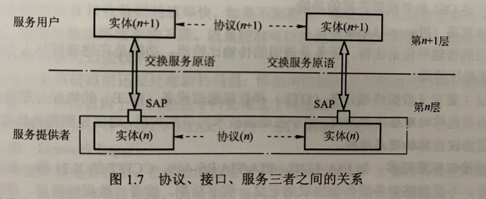

# 接口、服务和协议什么关系

接口这个词使用频率太高了，库和框架时，说接口文档；需求开发时，向后端要接口... 其次可能就是服务了。

接口、服务、协议间什么关系呢？

服务是「垂直的」，服务提供者通过接口，精确定义自己的服务范围，提供给上层。
这里十分关键的一点：并非一层内的全部功能都称为服务，只有哪些暴露出去，外部能看到，被接口定义的，才被称为服务。
协议时「水平的」，只有对等层级才会谈协议，不同层级间，协议应该时隐藏的实现。

三个词放在网络模型的场景中来理解：

## 分祯
