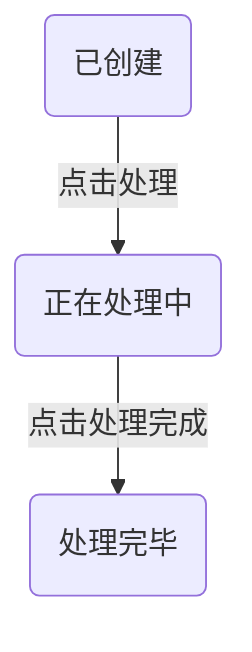
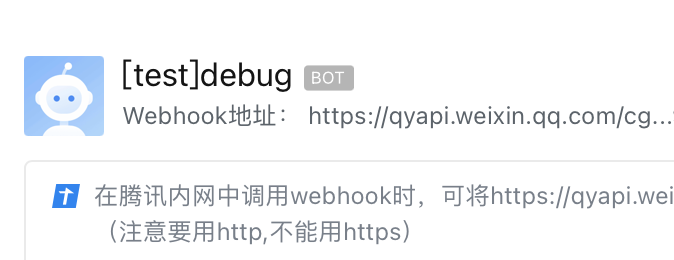
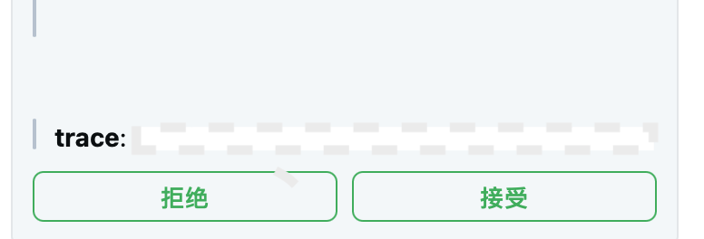
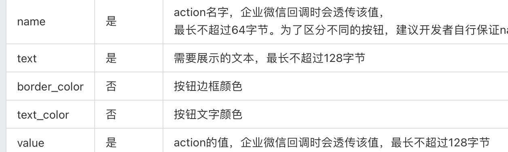
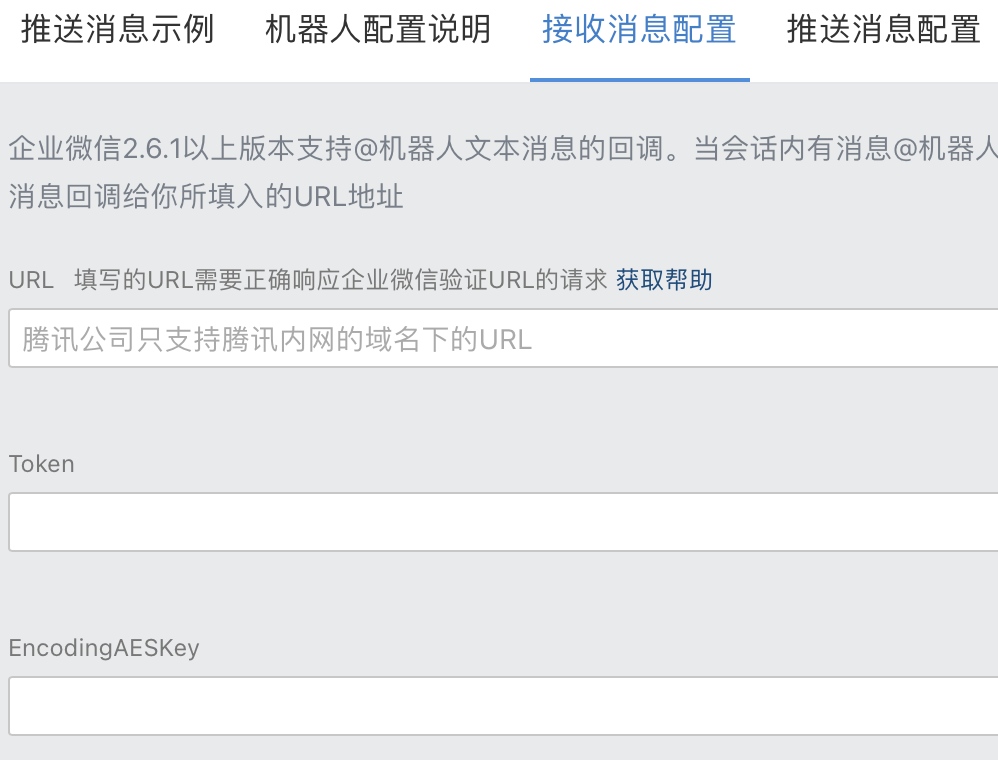
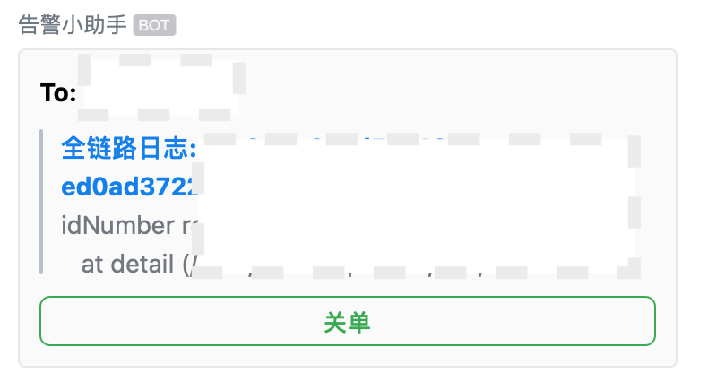
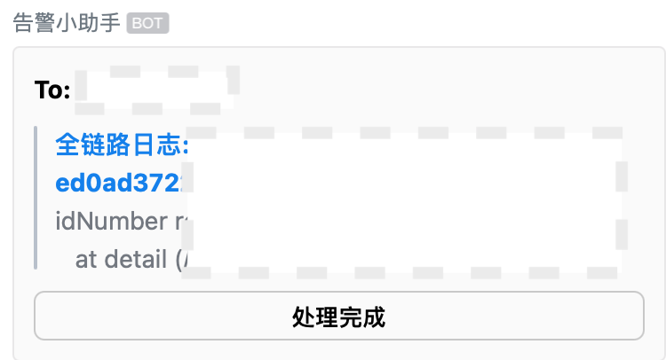
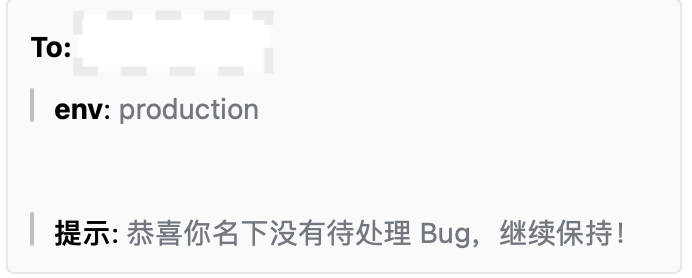

# 解决告警轰炸的一种实现

## 背景

监控和告警就像眼睛，是观测应用的窗口：服务的运行状况，及时感知异常。
而感知异常的办法，就是告警，微信、邮件、短信，不管什么途径，目的是提醒服务「可能」存在问题。

告警，按内容可以分为两类：

- 基于指标的告警
- 基于日志的告警

指标（metric）：通常由日志聚合而来，比如平均耗时、500的比例等。当指标超过某个阈值时，触发的告警，归为基于指标的告警。

日志：是服务的行为流水，最详尽的内容。当出现一个 error 类型的日志时，触发的告警，归为基于日志的告警。

从上面分类的定义，容易看出，基于日志的告警最容易形成告警轰炸，比如：

1. 一个调用链路上，某一处异常，往往会导致后续所有节点异常，一连串的异常日志导致告警轰炸。
2. 日志定级不合理，比如用户输入非法也用 console.error 来记录，属于把告警滥用为提醒的功能。
3. 「正常情形的异常」，比如，发现线上某个告警其实不用管，因为依赖服务的检验变更了，但是我们又不能为了屏蔽一个告警去改代码、发布。

无效告警掺杂的越多，异常问题发现越难，如果任其泛滥，告警会最终丧失及时感知异常的功能。

## 问题分析

仔细分析形成干扰的告警，可以分为：

1. 确实表明了服务异常的告警：
   1. 但是频率太高。
   2. 问题已确认，在修复和发布过程中，对其他异常告警形成干扰。
2. 不表示服务异常的告警，应该屏蔽，不再推送。

不管哪一种干扰告警，发现根本原因都是：缺少告警反馈机制。

**告警系统不仅要推送告警，还要能感知开发是否处理了这条告警。**

只有告警系统能感知开发如何处理了告警：拒绝处理、接受处理、不理睬，才能根据反馈，调整推送。

通过分析，明确了解决无效告警，即是给告警系统添加反馈机制。

## 方案设计

整个方案的核心部分：如何根据开发的反馈，设计推送策略。

### 推送策略

对于一条告警，开发有三个选项：

1. 不理睬
2. 拒绝
3. 接受

每个选项对应的推送策略：

1. 不理睬 - 连续三次不处理（不拒绝也不接受），一天内停止推送相同告警
2. 拒绝 - 三天内停止推送相同告警
3. 接受 - 停止推送相同告警，并新建 BUG 单，在 BUG 单状态变更为以修复后，恢复告警。

从推送策略中，发现有几个点需要进一步细化：

1. 如何判定相同告警，即如何计算告警的信息的标识
2. 告警和 Bug 单的打通，以及 Bug 单状态的流转。

### 告警标识

告警信息背后一般是结构化的数据，包含 traceid、message、error stack 等。

如果告警 message 相同，即语意相同，可判定为相同告警。
所以，告警的标识可以取 message 的前 100 字节。

### Bug 单及状态流转

首先一个 Bug 至少要记录以下属性：

- msgid: 告警消息标识
- trace: 告警的链路 id，用于日志系统
- assign: 处理人
- status: bug 单的状态

Bug 单的状态 status 及流转：



## 实现

以企业微信机器人作为告警工具（企业微信机器人的用法可以参考开发者文档）。

### 推送的实现

#### 1. 获取企业微信机器人的回调地址

即 Webhook 地址，新建机器人时会给出：


#### 2. 把日志输出到机器人

使用 [log4js](https://www.npmjs.com/package/log4js) 作为日志工具库。

```js
import log4js from 'log4js';
```

开发自定义 appender，向机器人输出日志

```js

function robotAppender(layout, timezoneOffset) {
  return (loggingEvent) => {
    const logCtx = loggingEvent.context;

    // 如果日志等级在 error 以上，高级
    if ((loggingEvent.level as Level).isGreaterThanOrEqualTo(levels.ERROR)) {
      // 调用机器人告警
      sendAlert(`[${msgObj.level}]${projectName}`, {
        path: loggingEvent.context.path || '', // path
        ctx: ctxStr.length > ctxStrLimit ? requestDataStr : ctxStr, // ctx
        msg: (layout(loggingEvent, timezoneOffset) as string)?.slice(0, ctxStrLimit) || '', // 日志内容
        trace: loggingEvent.context.trace || '', // trace_id
      });
      return true;
    }
  };
};

export function wxConfigure(config: any, layouts: any) {
  let layout = layouts.colouredLayout;
  if (config.layout) {
    layout = layouts.layout(config.layout.type, config.layout);
  }
  return robotAppender(layout, config.timezoneOffset);
}

// 配置到 log4js
log4js.configure({
  appenders: {
   console: {
      type: 'console',
    },
    // 企业微信机器人通知
    wx: {
      type: { configure: wxConfigure },
      layout: { type: 'basic' },
    },
  },
  categories: {
    default: { appenders: ['console', 'wx'], level: 'debug' },
  },
});
```

#### 3. 封装告警函数 sendAlert

在告警函数里应用发送策略：

- 对于判定为无效的告警，redis 加锁，阻止再次发送。
- 对每个发送的告警，在 redis 里计数，超过三次相同告警没有处理，执行加锁。

```js
async function sendAlert(title: string, data: Record<string, any>, chatid?: string) {
    // 计算告警信息标识，暂时只取 msg 的前 100 字节
    const msgId = getMsgId(data.msg);

    // 先判断有没有锁
    const lockKey = `${msgId}_lock`;
    // 这里使用 ioredis，跳过 redisClient 的封装
    const lock = await defaultRedisClient.get(lockKey);
    if (lock) {
      console.log('lock exsit, skip alert', title, data);
      return;
    }

    // 进行计数
    let rawCounter = await defaultRedisClient.get(msgId);
    // 如果之前没有发送过，初始化
    if (!rawCounter) {
      rawCounter = '0';
    }
    const counter = parseInt(rawCounter, 10);
    // 如果已经发送 3次或以上，加锁，禁止此次发送
    if (counter > 2) {
      // rm counter
      // 要先 rm，可以 rm 失败，下次还会进入告警计数
      await defaultRedisClient.del(msgId);
      // add lock
      await defaultRedisClient.setex(lockKey, 1 * 24 * 60 * 60 * 1000, data?.trace);
      // 可以推送提示：
      // (`三次未处理告警: ${msgId}  \n\n\n
        // 已终止该告警推送，24h 时后恢复！
      // `, undefined, chatid);
      return;
    }
    // 否则仅仅是计数加一
    await defaultRedisClient.set(msgId, String(counter + 1));

    const copyedData = {
      env,
      ...data,
    };
    let content = `### ${title} \n`;
    Object.keys(copyedData).forEach((key) => {
      content += `> **${key}**: <font color="comment">${copyedData[key]}</font> \n\n\n`;
    });
    const msgObj = {
      chatid,
      msgtype: 'markdown',
      markdown: {
        content,
        // 注意这里：搜集反馈的按钮
        attachments: [{
          callback_id: 'alert_feedback',
          actions: [{
            name: `reject_${data?.trace}`,
            text: '拒绝',
            type: 'button',
            // 这里使用 消息的标识：msg 的 前 100 字节
            value: msgId,
            replace_text: '已拒绝',
            border_color: '2EAB49',
            text_color: '2EAB49',
          },
          {
            name: `accept_${data?.trace}`,
            text: '接受',
            type: 'button',
            value: msgId,
            replace_text: '已接受',
            border_color: '2EAB49',
            text_color: '2EAB49',
          },
          ],
        },
        ],
      },
    };

    // url 为机器人回调地址
    return axios.post(url, msgObj, {
      headers: {
        'Content-Type': 'application/json',
      },
    });
  }
```

** 特别注意调用机器人接口传入的 attachments，可以为每个告警附加反馈按钮**，效果：

上面有一个容易忽略的点：如何设置每个按钮的 name、value。

通过上面的代码看到：

```js
{
  name: `accept_${data?.trace}`,
  value: msgId,
},
```



这两个字段，在用户点击按钮时，原封不动回调给我们，所以，要利用好这两个字段做数据传递：

- msgid，是加锁的必须信息，也是建 bug 单的必须字段。
- trace，全链路 id，建 bug 单需要，用于到日志系统追查。

### 接受按钮点击的消息 

开发点击了告警按钮，这时要调整告警推送策略，具体来说，就是对特定消息加锁，阻止推送。


这里要开发一个 HTTP Server，并且正确处理企业微信的验证请求。（这部分单独一篇来说）

现在先把关注点调到回调的处理：
当开发点击了按钮，企业微信会发起一个 HTTP 调用到我们 Server，对请求数据解密后，会得到类似下面的数据：

```js
{
  From: { 
    UserId: 'xxxxxxx', 
    Name: 'fjywan', 
    Alias: 'fjywan' 
  },
  WebhookUrl: 'http://in.qyapi.weixin.qq.com/cgi-bin/webhook/send?key=xxxx', 
  ChatId: 'xxxx', 
  GetChatInfoUrl: 'http://in.qyapi.weixin.qq.com/cgi-bin/webhook/get_chat_info?code=xxxxx',
  MsgId: 'xxxxx',
  ChatType: 'group', 
  MsgType: 'attachment',
  Attachment: {
    CallbackId: 'alert_feedback',
    Actions: { 
      Name: 'accept-traceidxxx',
      Value: 'msgidxxxx', 
      Type: 'button' 
    } 
  },
  TriggerId: 'xxxx',
}
```

下面处理这条消息：

```js
function getLockKey(msgId: string) {
  return `${msgId}_lock`;
}
enum BugStatus {
  Created = 1,
  Processing = 2,
  Done = 3
}
export async function alertFeedBack(payload: AttachmentMsg) {
  const {
    From: {
      Alias,
    },
    Attachment: {
      Actions: {
        Name,
        Value,
      },
    } } = payload;
  const lockKey = getLockKey(Value);
  const [actualName, trace] = Name.split('_');
  // 如果存在 counter，先移除
  await defaultRedisClient.del(Value);

  try {
  // 接受告警的处理
    if (actualName === 'accept') {
    // 加不失效锁
      await defaultRedisClient.setnx(lockKey, Name);
      const now = Date.now();
      // 这里使用 ORM prisma 往 MYSQL 数据插一条 bug 数据
      await prisma.bug_list.create({
        data: {
          assign: Alias,
          trace,
          msgId: Value,
          status: BugStatus.Created,
          updatedAt: now,
          createdAt: now,
        },
      });
    } else {
    // 拒绝告警的处理
    // redis 加锁，3天有效期，后面都不在提醒
    // 如果推送连续三条，用户不处理，加锁一天
      await defaultRedisClient.setex(lockKey, 3 * 24 * 60 * 60 * 1000, Name);
    }
  } catch (e) {
    console.error('执行加锁出错', e);
  }
}
```

### Bug 单的记录

创建一个下面结构的表，用于记录 Bug，做状态流转：

```sql
CREATE TABLE `bug_list` (     
  `id` INTEGER NOT NULL AUTO_INCREMENT,     
  `msgId` VARCHAR(191) NOT NULL,     
  `trace` VARCHAR(60) NOT NULL,     
  `assign` VARCHAR(30) NOT NULL,     
  `status` TINYINT(2) NOT NULL,     
  `remark` LONGTEXT,     
  `updatedAt` BIGINT(20) NOT NULL,    
  `createdAt` BIGINT(20) NOT NULL,     
   PRIMARY KEY (`id`),     
   unique key (msgId),     
   unique key (trace) 
) 
```

### Bug 单查询

当 @机器人时，希望机器人能返回当前用户待处理 Bug 单，并且能给出按钮进行状态操作。

这里调整 @ 回调的监听，关注回调的处理函数：

```js
// 返回当前开发的 Bug 列表
export async function buglist(payload: WxMsg) {
  const { From: { Alias }, Text: { Content: raw }, ChatId } = payload;
  const title = `To: ${Alias}`;
  const result = await prisma.bug_list.findMany({
    where: {
      assign: Alias,
      status: {
        in: [1, 2],
      },
    },
  });
  if (!result.length) {
    // 回消息
    sendBack(title, {
      提示: '恭喜你名下没有待处理 Bug，继续保持！',
    }, ChatId);
    return;
  }

  // 生成 Bug 列表的消息体
  let content = `### ${title} \n`;
  const attachments = [{
    callback_id: 'bug_status_change',
    actions: [],
  }] as unknown  as Attachments;
  result.forEach((one) => {
    content += `> **[全链路日志:${one.trace}](xxxx)**: <font color="comment">${one.msgId}</font> \n\n\n`;
    // important: 这里为每个 Bug 单生成对应处理按钮
    attachments[0].actions.push({
      name: String(one.id),
      text: one.status === 1 ? `${one.id}:转为处理中` : `${one.id}:关单`,
      type: 'button',
      // 这里使用 消息的标识：msg 的 前 100 字节
      value: one.status === 1 ? '2' : '3',
      replace_text: one.status === 1 ? '处理中' : '处理完成',
      border_color: '2EAB49',
      text_color: '2EAB49',
    });
  });
  sendBack(content, attachments, ChatId);
}
```

当 @ 机器人时，效果如下：


### Bug 单流转

类型告警的按钮，Bug 单的按钮被点击后，处理状态变更，同时移除 redis 对应告警的锁。

```js
export async function bugStatusChange(payload: AttachmentMsg) {
  const {
    From: {
      Alias,
    },
    Attachment: {
      Actions: {
        Name,
        Value,
      },
    } } = payload;
  try {
    const theBug = await prisma.bug_list.update({
      data: {
        status: parseInt(Value, 10),
      },
      where: {
        id: parseInt(Name, 10),
      },
    });
    // 移除锁
    const { msgId } = theBug;
    const lockKey = getLockKey(msgId);
    defaultRedisClient.del(lockKey);
  } catch (e) {
    console.error('更新 bug 状态出错', e);
  }
}

```

效果如下：



## 总结

无效告警泛滥的根本原因是缺乏告警反馈机制。我们通过企业微信机器人，闭环了告警、告警反馈、Bug 跟踪及流转。

下面整理下技术要点：

1. 拒绝处理或三次无反馈，短暂停止相同告警的推送。
2. 相同告警的判定，使用 error 的 message。
3. 使用 redis 存「告警黑名单」，适应多实例运行。
4. 可以把机器人理解为一种命令行，对非开发更友好的命令行。
5. 指标告警一般通过设置阈值触发，而且往往有限频处理（在阈值附近波动的情况），无需反馈机制。

可运行的代码，整理后会放到 github。

## 拓展

其实，上面存在一个假定：存在全链路日志系统。不仅告警，还要能通过告警快速捞出相关日志定位问题。

后面专门一篇介绍，如何搭建全链路日志系统；同样还会有一篇专门介绍企业微信机器人开发。
