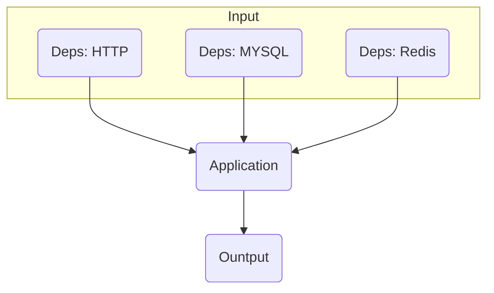

# 隔离 HTTP 依赖稳定运行 e2e 测试用例的一种实现

## 背景

端到端测试(End-to-end Testing)，用于验证应用的整体行为。
相对于单元测试（Unit Testing）专注在函数功能验证，e2e 更容易出现外部依赖，比如依赖外部 HTTP 接口数据、MYSQL 数据、Redis 数据等，这些都可以理解为外部数据依赖，影响应用的行为，但是却不受应用控制。



如果把应用整体抽象为一个 Input-Ouput，影响应用输出（Output）的因素，就是这些外部依赖（Input）。
所以，只要能 mock 这些依赖，就能稳定的运行 e2e 测试用例。

## 问题引入

这里把问题聚焦在 Node 应用，隔离其他 HTTP 依赖，稳定运行每个接口的测试用例。

Node 服务用户登录接口测试的例子：

```js
describe('user', () => {
 it('login by phone number', async (done) => {
    const res = await userLogin(axios, {
      phoneNumber: '15555555555',
    });
    assert.ok(Array.isArray(res.data?.data));
    done();
  });
  it('login by phone id', async (done) => {
    const res = await userLogin(axios, {
      id: 1,
    });
    assert.ok(Array.isArray(res.data?.data));
    done();
  });
  it('login by account & pwd', async (done) => {
    const res = await userLogin(axios as any, {
      account: 'test',
      pwd: 'test',
    });
    assert.ok(Array.isArray(res.data?.data));
    done();
  });
  it('login by account & pwd after change pwd', async (done) => {
    const res = await userLogin(axios as any, {
      account: '1',
      password: '2',
    });
    assert.ok(Array.isArray(res.data?.data));
    done();
  });
}
```

> 例子说明：userLogin 调用了 Node 服务提供的用户登录接口，Node 服务会执行一些数据校验和预处理，然后调用另一个 HTTP API 执行登录。

我们发现，用户登录接口，有多种入参的可能，也对应不同的表现。隔离用户登录接口背后的 HTTP API(用 Dep0 指代)，需要：记录 Dep0 的多条请求和返回记录，并和对应用例匹配。

所以这里的问题是：

1. 一个外部 HTTP 依赖，要记录多种场景的请求参数/返回数据；
2. 记录的数据和测试用例匹配；
3. 测试用例运行时，能根据命令，执行录制外部 HTTP 请求，或者读取已经录制的 HTTP 请求。

## 实现

### 如何录制

这里采用 axios interceptor 做录制：

```js
import { AxiosRequestConfig, AxiosResponse } from 'axios';
import 'url';
import fs from 'fs-extra';
import { getCtxLogger } from '../../services/context';
import crypto from 'crypto';

// 一些常量
const defaultFilePath = `${process.cwd()}/deps/net/`;
const ext = '.json';

// 请求前记录请求入参
export const requestInterceptor = async (config: AxiosRequestConfig) => {
  const { url, method } = config;
  const urlObj = new URL(url as string);
  const { pathname } = urlObj;
  const filePath = getFilePathFromConfig(config);
  try {
    await fs.ensureFile(filePath);
    const rawCurrentContent = await fs.readFile(filePath, 'utf8');
    let currentContent = {};
    try {
      if (rawCurrentContent) {
        currentContent = JSON.parse(rawCurrentContent);
      }
    } catch (e) {
      console.error(`JSON.parse ${filePath} error, use empty object`, e);
    }
    if (!currentContent[pathname]) {
      currentContent[pathname] = {};
    }
    if (!currentContent[pathname][method as string]) {
      currentContent[pathname][method as string] = {};
    }
    const hash = getHashFromConfig(config);
    if (!currentContent[pathname][method as string][hash]) {
      currentContent[pathname][method as string][hash] = {};
    }
    // force update
    currentContent[pathname][method as string][hash].request = config;
    await fs.writeJSON(filePath, currentContent);
  } catch (e) {
    console.error('deps/net requestInterceptor error', e);
  }
  return config;
};

// 响应后，记录返回
export const responseInterceptor = async (response: AxiosResponse) => {
  const { config } = response;
  const { url, method } = config;
  const urlObj = new URL(url as string);
  const { host, pathname } = urlObj;
  const filePath = `${defaultFilePath}${host}${ext}`;
  try {
    await fs.ensureFile(filePath);
    const rawCurrentContent = await fs.readFile(filePath, 'utf8');
    const currentContent = JSON.parse(rawCurrentContent);

    const hash = getHashFromConfig(config);
    // force update
    if (!currentContent[pathname][method as string][hash]) {
      currentContent[pathname][method as string][hash] = {};
    }
    currentContent[pathname][method as string][hash].response = response.data;
    await fs.writeJSON(filePath, currentContent);
  } catch (e) {
    console.error('deps/net responseInterceptor error', e);
  }
  return response;
};

// 辅助函数，从 config 对象中计算记录文件的路径
export function getFilePathFromConfig(config: AxiosRequestConfig): string {
  const { url } = config;
  const urlObj = new URL(url as string);
  const { host } = urlObj;
  const filePath = `${defaultFilePath}${host}${ext}`;
  return filePath;
}
```

这里有一个需要注意的地方：
如何根据请求入参，计算出一个标识，在请求返回后，能够根据 response 再次计算出同样的标识，只有这样，才能把一次 HTTP 的请求和响应对应起来。完成这个功能函数就是上面的 getHashFromConfig：

```js
function getHashFromConfig(config: AxiosRequestConfig): string {
  const pure = {
    url: config.url,
    params: config.params,
    cookie: config.headers?.cookie,
    data: config.data,
  };
  const strData = JSON.stringify(pure);
  // 对 config 求 hash
  const hash = crypto.createHash('md5').update(strData)
    .digest('hex');
  return hash;
}
```

这里没有直接对 AxiosRequestConfig 求 hash，而是仅提取其中几个关键字段 hash。因为测试中发现：

response 的 config 在请求前后，会存在字符串级别的不一致，比如 header。

执行后记录的结果：

```json
{
  "/ws/district/v1/list": {
    "get": {
      "e4473f2e67634485d3b6defd93a502f1": {
        "request": {
          "transitional": {
            "silentJSONParsing": true,
            "forcedJSONParsing": true,
            "clarifyTimeoutError": false
          },
          "transformRequest": [
            null
          ],
          "transformResponse": [
            null
          ],
          "timeout": 0,
          "xsrfCookieName": "XSRF-TOKEN",
          "xsrfHeaderName": "X-XSRF-TOKEN",
          "maxContentLength": -1,
          "maxBodyLength": -1,
          "headers": {
            "common": {
              "Accept": "application/json, text/plain, */*"
            },
            "delete": {},
            "get": {},
            "head": {},
            "post": {
              "Content-Type": "application/x-www-form-urlencoded"
            },
            "put": {
              "Content-Type": "application/x-www-form-urlencoded"
            },
            "patch": {
              "Content-Type": "application/x-www-form-urlencoded"
            }
          },
          "method": "get",
          "url": "https://apis.map.qq.com/ws/district/v1/list"
        },
        "response": {
          "status": 301,
          "message": "缺少必要字段key"
        }
      }
    }
  }
}
```

#### 小结

至此，我们完成了 HTTP 请求的记录。而且还顺带解决了记录内容和用例匹配的问题：
根据请求入参 hash，就可以唯一标识一次同样入参的请求。

### 请求函数如何读取 mock 数据

同样也是基于 axios interceptor 实现：

```js
export const mockedRequest = axios.create();
// 参考: https://stackoverflow.com/questions/62686283/axios-how-to-intercept-and-respond-to-axios-request
mockedRequest.interceptors.request.use((config) => { const { url, method } = config;
  const urlObj = new URL(url as string);
  const { pathname } = urlObj;

  throw {
    // 计算 hash，用于匹配记录的数据 
    hash: getHashFromConfig(config),
    filePath: getFilePathFromConfig(config),
    pathname,
    method,
  }; // <- this will stop request and trigger
});

mockedRequest.interceptors.response.use(
  response => response,
  async (error) => {
    const hash = error?.hash;
    const filePath = error?.filePath;
    const {
      pathname,
      method,
    } = error;
    const rawCurrentContent = await fs.readFile(filePath, 'utf8');
    let currentContent = {};
    try {
      if (rawCurrentContent) {
        currentContent = JSON.parse(rawCurrentContent);
      }
    } catch (e) {
      console.error(`JSON.parse ${filePath} error, use empty object`, e);
    }

    const res =  {
      data: currentContent[pathname][method][hash]?.response,
    };
    return res;
  }  // <- sends as successful response
);
```

这里利用了 axios request interceptor 会终止请求的特性，重定向到读取本地记录的数据。

最后加上根据环境变量自动切 mock 和录制：

```js
// 用环境变量 RECORD，开启记录模式
if (process.env.RECORD) {
  request.interceptors.request.use(requestInterceptor);
  request.interceptors.response.use(responseInterceptor);
}
```

#### 小结

记录的 JSON 跟随 git 管理，上面实现的 mockRequest 应用在 e2e 测试中，就可以稳定的重放 HTTP 响应，保证 CI 的时候测试用例正常运行。

## 总结

通过 axios interceptor，完成了外部 HTTP 依赖的隔离。

其实，我们记录的外部 HTTP 接口的请求和响应数据，除了用于 mock，还可同时用于推导类型，免除手动书写 interface。

```js
import mockData from '../deps/net/apis.map.qq.com.json';
d
type ListResponse = typeof mockData['/ws/district/v1/list'].get.e4473f2e67634485d3b6defd93a502f1.response;
```

最后附上完整实现：https://github.com/xiaoshude/node-common

### 扩展

这里从应用内出发，实现 HTTP 依赖隔离，如果考虑通用方案，也可以尝试下直接覆写 Node http 模块的方法做流量拦截。
